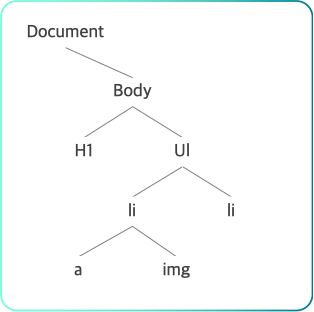

# **DOM**
> <b style='color:#4AC29A'>DOM이란?</b>   
Document Object Model 으로,    
JavaScript를 사용할 수 있으면 DOM으로 HTML을 조작할 수 있다.

</img> 
 DOM의 구조

***

## 📌 **<span style='color:#4AC29A' >HTML</span>에 <span style='color:#4AC29A' >JavaScript</span>를 적용하는 방법**

HTML에 JavaScript를 적용하기 위해서는 `<script>` 태그를 이용합니다. 아래의 경우 HTML 파일과 같은 디렉토리에 존재하는 `myScriptFile.js`을 불러옵니다.

```javascript
<script src="myScriptFile.js"></script>
```
<br/><br/>

### 📌 실행의 우선순위   
1. `<script>` 요소   
2. `HTML`

<br/><br/>

### 📌 `<script>` 요소의 위치에 따른 차이점
🧩 1. `<header>`
- 스크립트 정보를 다 읽은 후 HTML을 읽기 때문에 사용자경험 ↓
- `<head>` 태그 안에서 `<script>`를 선언하고 `<body>`안에 선언해 놓은 태그에 대한 작업을 할 때,
    
    해당 `<script>`가 수행되는 시점에서 `<body>`태그는 아직 파싱되기 전이기 때문에 `<script>`에서 해당 태그가 무엇인지 알 수가 없게 된다.
    
- DOM 객체가 생성되기 전에 실행된다.
    
    → DOM객체에 접근이 필요한 스크립트의 경우, window.onload() 와 같은 로드 이벤트 사용해야한다.
    
- 스크립트가 너무 무거울 경우, DOM 생성이 늦어져 화면이 늦게 출력된다.
    
    → 문서 초기화를 위한 가벼운 스크립트를 주로 head에서 호출한다.

<br/>

🧩 2. `</body>` 바로 앞
- 렌더링이 완료된 이후 스크립트가 실행된다.
    
    → 스크립트가 컨텐츠를 변화시킬 경우, 화면에 노출된 채로 변경된다.
    
- DOM 생성이 완료되었기 때문에, 로드 이벤트와 같은 설정이 필요없다.
- body는 위에서 아래로 읽기 때문에, 화면을 최대한 빠르게 띄우는 것이 목적이라면 script는 body 최하단에 두는 것이 좋다.

<br/><br/>

### 📌 console.log와 console.dir의 차이점
||console.log|console.dir|
|:---:|:---:|:---:|
|출력|매개변수로 전달된 값|매개변수로 전달된 객체의 속성|
|구조|HTML과 같은 트리 구조|JSON과 같은 트리 구조|
|특징|DOM 요소에 대해 특별한 처리를 제공|DOM JS 객체의 전체 표현을 보려고 할 때 유용|
|주사용|나머지|객체|

자바스크립트에서 DOM은 document 객체에 구현되어 있습니다. 브라우저에서 작동되는 자바스크립트 코드에서는, 어디에서나 document 객체를 조회할 수 있습니다. 
```javascript
// 예시
document.body.children[1]
```

<br/><br/>

### 📌 DOM을 다루는 방법


🧩 -1.CREATE   
DOM을 JavaScript로 조작하여 HTML Element를 추가할 수 있다.  
-1-1. const 변수명 = document.createElement('요소')
```javascript
const treetDiv = document.createElement('div')
```

<br/>

🧩 -2 APPEND   
생성한 HTML Element를 부모 엘리먼트의 자식 엘리먼트로 포함할 수 있다.  
-2-1. append 라는 메서드를 사용해서, 변수 tweetDiv 를 `<body>` 에 넣어 본다
```javascript
document.body.append(tweetDiv)
```
새롭게 생성한 `<div>` 요소에 아무런 내용을 입력하지 않아서 보이는 내용이 없을 뿐이다

<br/>

🧩 -3 READ   
DOM을 JavaScript로 조작하여 HTML Element를 조회할 수 있다.  
DOM으로 HTML 엘리먼트의 정보를 조회하기 위해서는 querySelector의 첫 번째 인자로 셀렉터(selector)를 전달하여 확인할 수 있습니다. 셀렉터로는 HTML 요소("div"), id("#tweetList"), class(.tweet) 세 가지가 가장 많이 사용됩니다.

querySelector
```javascript
const oneTweet = document.querySelector('.tweet')


const tweets = document.querySelectorAll('.tweet')
```
querySelectorAll로 조회한 HTML 요소들은 배열처럼 for문을 사용할 수 있다.  
But, 배열은 아니다.
> Array-like Object

정식 명칭은 위와 같다

<br/>

🧩 -4 UPDATE   
DOM을 JavaScript로 조작하여 HTML Element를 변경할 수 있다.
-4-1 비어있는 div 엘리먼트에 문자열을 입력  
```javascript
tweetDiv.textContent = 'content';
```
-4-1 Element에 `class`추가
```javascript
treetDiv.classList.add('tweet');
```
<br/>

🧩 -5 DELETE   
DOM을 JavaScript로 조작하여 HTML Element를 삭제할 수 있다  
-5-1. 삭제하려는 요소의 위치를 알고 있는 경우
```javascript
tweetDiv.remove()
```
-5-2. 여러개의 자식 요소를 제거
```javascript
document.querySelector('#container').innerHTML = '';
```
주의 : 보안 문제 보유

-5-3. removeChild 와 반복문 사용
```javascript
const container = document.querySelector('#container');
while (container.firstChild) {
  container.removeChild(container.firstChild);
}
```

-5-4. 
```javascript
const tweets = document.querySelectorAll('.tweet')
tweets.forEach(function(tweet){
    tweet.remove();
})
// or
for (let tweet of tweets){
    tweet.remove()
}
```
