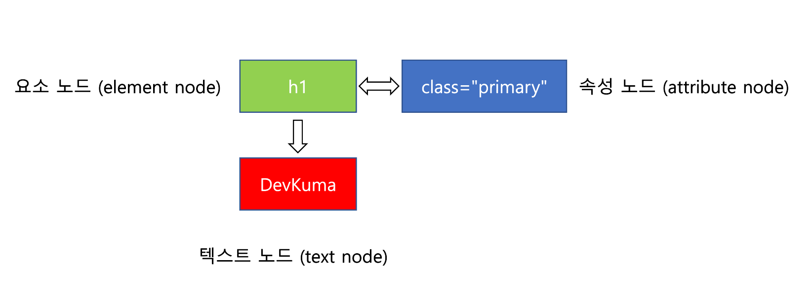

# DOM

## 📌 DOM이란?
Document Object Model라는 뜻으로 HTML 문서의 계층적 구조와 정보를 표현하며 이를 제어할 수 있는 API, 즉 프로퍼티와 메소드를 제공하는 트리구조이다.

## 📌 HTML 요소와 노드객체란?

- HTML 요소 : HTML 문서를 구성하는 각각의 요소들로 시작 태그, 속성, 내용, 종료 태그가 있다.
<p align="center">
  
</p>

- 노드 객체 : HTML 요소를 엔진에 의해 파싱되어 DOM을 구성하는 요소로 변환한 것
<p align="center">
  
</p>

```HTML
<!--코드로 노드를 확인해 보기-->
<!DOCTYPE html>
<html lang="kr">
    <head>
        <meta charset="UTF-8">
    </head>
    <body>
        <h1 class="primary">DevKuma</h1>
    </body>
    <script>
        // 요소 노드에 접근
        const $elementNode = document.querySelector(".primary");
        // 요소 노드의 텍스트 노드에 접근
        const $textNode = $elementNode.textContent;
        // 요소 노드의 속성의 이름이 class인 노드에 접근
        const $attributeNode = $elementNode.getAttribute("class");
        console.log($elementNode);
        console.log($textNode);
        console.log($attributeNode);
    </script>
</html>
```
## 📌 DOM 트리란?
노드 객체들로 구성된 트리 자료구조이다.
</br>
<p align="center">
  
</p>
</br>

1. 루트 노드 : 최상의 노드를 뜻한다.    
**❕ document**
2. 부모 노드 : 노드간 계층에서 위에 있는 노드를 뜻한다.   
**❕ body 태그는 div 태그의 부모 노드이다.**
3. 형제 노드 : 노드간 계층에서 같은 레벨에 있는 노드를 뜻한다.   
**❕ li 태그들**
4. 자식 노드 : 노드간 계층에서 아래에 있는 노드를 뜻한다.   
**❕ div 태그는 body태그의 자식 노드이다.**
5. 리프 노드 : 자식 노드가 없는 노드를 리프 노드라고 한다.   
**❕ text**

### 🧩 노드의 중요한 타입 4가지

- 문서 노드 : DOM트리의 최상단에 존재하는 루트 노드로써 document를 가리킨다.   
① HTML 문서당 document 객체는 유일하다.   
② document 객체는 DOM트리의 루트 노드로써 노드들에 접근하기 위한 진입점 역할을 수행한다.
- 요소 노드 : HTML 요소를 가리키는 객체이다.   
① 요소 노드는 HTML간 요소간의 부자관계로 나타낼 수 있다.   
② 문서의 구조를 표현한다.   
③ 요소 노드는 HTML의 태그라고 생각해도 무관하다.

- 속성 노드 : HTML의 속성을 가리키는 객체이다.   
① 속성 노드는 요소 노드와 연결되어 있다.   
② 속성 노드를 참고하거나 변경하려면 먼저 요소 노드에 접근해야 한다.   
③ 속성 노드는 부모 노드가 존재하지 않는다.

- 텍스트 노드 : HTML의 내용을 가리키는 객체이다.   
① 텍스트 노드는 요소노드의 자식 노드이다.

## 📌 노드 객체의 상속 구조 **❕ input 태그**

| 프로토타입 체인 순서 | 요소 노드 객체의 특성  | 프로토타입 객체         |
| :---------------   | :-------------------- | :-------------------- |
| 1                  | input 요소 객체        | HTMLInputElement      |
| 2                  | HTML 요소 객체         | HTMLElement           | 
| 3                  | 요소 객체              | Element               | 
| 4                  | 노드 객체              | Node                  |
| 5                  | 이벤트 객체            | EventTarget           |
| 6                  | 객체                   | Object                |

1. HTMLInputElement : input 태그만의 고유한 기능을 제공한다.   
2. HTMLElement : 모든 HTML의 태그의 공통적인 기능들을 제공한다.   
3. Element : 요소 태그의 기능들을 제공한다.   
4. Node : 노드 태그의 탐색등등 노드 태그와 관련된 기능들을 제공한다.   
5. EventTarget : 이벤트 기능을 제공한다.   
6. Object : JavaScript의 객체 프로토타입이다.

**🔥 메소드중 Element 메소드는 HTML요소만 반환하는 반면에 Node 메소드는 텍스트 노드도 같이 반환하는 경우가 있다. Element는 즉 요소 노드와 관련된 것이며 Node의 개념이 더 큰 개념이다.**