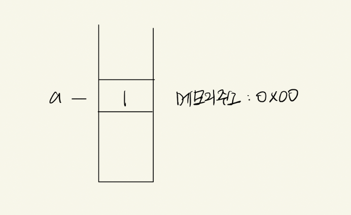

# 변수와 상수

## 📌 변수와 상수란?

- 식별자의 종류에는 상수와 변수가 존재한다.
- 상수의 값은 불변이며 변수의 값은 교체가 가능하다.

### 🧩 변수

- 변수란 사전적 의미로 변경할 수 있는 값으로 메모리 공간에 저장되는 하나의 값이다.
- 변수에 여러개의 값을 저장하는 방법으로는 배열과 객체를 이용하여 그룹화한다.
- 배열에 객체를 넣어서 사용할 수도 있다.
- 변수의 값을 사용하거나 읽어오면 변수 참조라고 한다.
- `var와 let` 문법을 사용한다.

### 🧩 상수

- 상수란 사전적 의미로 변경할 수 없는 값으로 메모리 공간에 저장되는 하나의 값이다.
- `const` 문법을 사용한다.

## 📌 변수가 undefined으로 초기화되는 이유

변수에 메모리 주소를 할당할 때 메모리의 값이 있을 수도 있으므로 혹시 모를 상황을 방지하기 위해 `undefined`로 초기화를 진행한다.

### 🧩 메모리에 쓰레기값이 들어있다고 가정

변수를 선언하였을 때 우연히 메모리에 쓰레기값이 남아있는 주소를 할당받았다는 과정

<p align="center">
  
</p>

```javascript
let a;
// 위의 상황을 가정하면 결과가 1이 나온다.
console.log(a);
```

### 🧩 메모리를 초기화 하는 과정

<p align="center">
  
</p>

```javascript
// (1)번 진행
let a;
// 결과 : undefined
console.log(a);
// (2)번 진행
a = 1;
// 결과 : 2
console.log(2);
```

- 혹시 모를 쓰레기 값을 방지하기 위해 메모리에 undefined를 할당한 주소값으로 처음에 초기화 시킨 뒤에 값 1을 할당한다.

- `let a = 1`처럼 선언과 할당을 동시에 하더라도 초기화가 진행된 뒤 할당한다.

## 📌 var, let의 차이점

- let을 사용하는 이유는 var 변수의 호이스팅 문제 때문에 사용한다.
- var와 let은 생성하는 스코프의 영역도 다르다.
- let은 호이스팅이 발생은 하지만 자바스크립트 엔진에서 오류를 출력해준다.
- var는 호이스팅이 발생하면 초기화 변수인 undefined 출력된다.

```javascript
// 결과 : 오류 출력
console.log(name);
// 변수의 선언과 할당
let name = "YHJ";
```

### 🧩 호이스팅이란?
사전적 의미로는 끌어올린다는 뜻으로 변수가 아래에 선언이 되어도 있어도 최상단으로 끌어 올려진 것처럼 작동하는 것을 호이스팅이라고 한다.

- 변수의 값의 초기화 단계에서 변수에 `undefined`이 먼저 할당 된다.
- 값의 초기화 단계까지는 코드가 순차적으로 실행되기 이전에 실행된다.

```javascript
// 결과 : undefined
console.log(name);
// 변수의 선언과 할당
var name = "YHJ";
```

호이스팅은 변수선언과 할당이 실행문 아래에 있지만 초기화값인 undefined을 출력한다.

### 💡 let을 사용하는 이유

let을 사용하는 이유는 코드가 만약 길어진다면 var를 사용하여 의도치 않게 선언전에 할당을 하고 아래에 선언하였으면 undefined의 값을 사용하게 됨으로 개발자의 의도와 다른 값이 설정될 수 있으므로 그것을 방지하기 위해서 let을 사용하는것 같다.