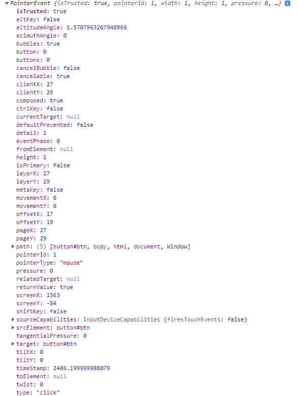

# 이벤트객체

## 📌 이벤트 객체란?

이벤트가 발생하면 이벤트에 관련된 이벤트 객체가 생성되어 이벤트 핸들러의 첫 번째 인수로 전달된다.

```html
<!DOCTYPE html>
<html>
    <head>
        <title>이벤트</title>
    </head>
    <body>
        <button id="btn" type="button">클릭</button>
    </body>
    <script>
        const $btn = document.querySelector("#btn");
        // 함수 생성
        const eventHandler = (param) => console.log(param);
        // 함수 실행
        eventHandler(1);
        // 이벤트 핸들러로 함수를 전달
        $btn.addEventListener("click", eventHandler);
    </script>
</html>
```

**🔥 이벤트 핸들러로 사용하기 전에 함수를 호출하면 넣어준 인자가 출력되지만 이벤트 핸들러로 함수가 사용되고 이벤트가 실행되면 이벤트 객체가 첫 번째 인자로 출력된다.**

```html
<!DOCTYPE html>
<html>
    <head>
        <title>이벤트</title>
    </head>
    <body>
        <button id="btn" type="button">클릭</button>
    </body>
    <script>
        const $btn = document.querySelector("#btn");
        // 이벤트가 발생하면 이벤트 객체가 첫 번째 인수로 전달된 걸 확인하기 위해 로그 출력
        $btn.addEventListener("click", (e) => {
            console.log(e);
        });
    </script>
</html>
```

**🔥 마우스 클릭에 관련된 이벤트 객체가 생성된다.**
<p align="center">
  
</p>

### 🧩 이벤트 객체의 사용 예시

```html
<!DOCTYPE html>
<html>
    <head>
        <title>이벤트</title>
    </head>
    <body>
        <ul id="animals">
            <li id="dog">개</li>
            <li id="cat">고양이</li>
            <li id="pig">돼지</li>
        </ul>
    </body>
    <script>
        const $animals = document.querySelector("#animals");
        $animals.addEventListener("click", (e) => console.log(e.target));
    </script>
</html>
```

**🔥 클릭 이벤트를 ul에 걸어주고 개, 고양이, 돼지를 클릭하면 이벤트를 발생 시킨 해당 li태그가 호출된다. 이벤트 객체 프로퍼티중 target은 이벤트를 발생시킨 해당 객체를 알려준다. 이런 프로퍼티를 이용해서 이벤트 위임을 구현할 수 있다.**

## 📌 이벤트 전파

이벤트가 생성된 시점에서 이벤트의 전파 과정으로 3가지 과정인 캡처링, 타깃, 버블링 과정으로 구분된다.

- 캡처링: 상위 요소에서 발생한 이벤트가 하위 요소 방향으로 전파되는 과정
- 타깃: 실제로 이벤트가 발생한 대상
- 버블링: 하위 요소에서 발생한 이벤트가 상위 요소 방향으로 전파되는 과정

<p align="center">
  
</p>

```html
<!DOCTYPE html>
<html lang="ko">
<head>
    <meta charset="UTF-8">
    <title>Event</title>
</head>
<body>
    <ul id="ul">
        <li id="li1">1</li>
        <li id="li2">2</li>
    </ul>
    <script>
        const $ul = document.querySelector("#ul");
        const $li1 = document.querySelector("#li1");
        const $li2 = document.querySelector("#li2");
        // 부모와 자식노드에 각각 내용이 다른 이벤트를 설정한다.
        $ul.addEventListener("click", () => {
            console.log("ul 클릭 이벤트 입니다.")
        });
        // 1을 클릭하는 순간 버블링으로 인해 ul 이벤트도 같이 발생한다.
        $li1.addEventListener("click", () => {
            console.log("li 클릭 이벤트 입니다.");
        });
    </script>
</body>
</html>
```

이벤트 버블링으로 인하여 콘솔창에 아래와 같은 내용이 나타나게 된다.

```javascipt
li 클릭 이벤트 입니다.
ul 클릭 이벤트 입니다.
```

이벤트 캡처링도 일어났지만 콘솔창에 확인이 되지않는 이유는 캡처링은 의도적으로 켜줘야 실행이 가능하다.

```html
<!DOCTYPE html>
<html lang="ko">
<head>
    <meta charset="UTF-8">
    <title>JS</title>
</head>
<body>
    <ul id="ul">
        <li id="li1">1</li>
        <li id="li2">2</li>
    </ul>
    <script>
        const $ul = document.querySelector("#ul");
        const $li1 = document.querySelector("#li1");
        const $li2 = document.querySelector("#li2");
        // 부모인 ul 태그의 캡처링 이벤트 설정
        $ul.addEventListener("click", (e) => {
            console.log(`이벤트 단계 : ${e.eventPhase}`);
            console.log(`이벤트 타깃 : ${e.target}`);
        }, { capture: true });
        // 자식인 li 태그의 이벤트 설정
        $li1.addEventListener("click", (e) => {
            console.log(`이벤트 단계 : ${e.eventPhase}`);
            console.log(`이벤트 타깃 : ${e.target}`);
        });
        $li2.addEventListener("click", (e) => {
            console.log(`이벤트 단계 : ${e.eventPhase}`);
            console.log(`이벤트 타깃 : ${e.target}`);
        });
        // 부모인 ul 태그의 이벤트 설정
        $ul.addEventListener("click", (e) => {
            console.log(`이벤트 단계 : ${e.eventPhase}`);
            console.log(`이벤트 타깃 : ${e.target}`);
        });
    </script>
</body>
</html>
```

1이나 2를 클릭하게 되면 콘솔창 결과는 아래와 같이 나오게 된다.

```javascript
// 1 : 이벤트 캡처링
이벤트 단계 : 1
이벤트 타깃 : [object HTMLLIElement]
// 2 : 이벤트 타깃
이벤트 단계 : 2
이벤트 타깃 : [object HTMLLIElement]
// 3 : 이벤트 버블링
이벤트 단계 : 3
이벤트 타깃 : [object HTMLLIElement]
```

## 📌 이벤트 위임

이벤트를 관리하는 방법으로 각각 노드에 이벤트를 등록하는 것이 아니라 하나의 상위 요소에 이벤트를 등록해서 관리하는 방법이다.

- 각각의 요소의 이벤트를 모두 등록하지 않아도 됨으로 메모리 절약이 가능하다.
- 코드의 재사용성이 높아진다.
- 이벤트 버블링의 특성을 이용한다.

### 🧩 이벤트 위임을 하지 않을 경우
```html
<!DOCTYPE html>
<html lang="ko">

<head>
    <meta charset="UTF-8">
    <title>Event</title>
</head>
<body>
    <!--li의 요소를 클릭했을 경우 해당 li의 이름이 h3의 텍스트로 나타난다.-->
    <ul class="animals" style="width: 400px; background-color: gold;">
        <li class="animal-li" data-animal-index="Dog">Dog</li>
        <li class="animal-li" data-animal-index="Cat">Cat</li>
        <li class="animal-li" data-animal-index="Pig">Pig</li>
        <li class="animal-li" data-animal-index="Caw">Caw</li>
    </ul>

    <h3 class="title"></h3>

    <script>
        // 모든 li 태그 요소를 가져온다.
        const $animalsLi = document.querySelectorAll(".animal-li");
        // 텍스트를 표시할 공간
        const $title = document.querySelector(".title");
        // live 객체로 오기 때문에 안전하게 배열로 변환한다.
        const list = [...$animalsLi];
        // 이벤트 핸들러 함수를 생성
        const eventHandler = (event) => {
            const name = event.target.dataset.animalIndex;
            // title의 텍스트를 설정
            $title.innerText = name;
        }
        // 각각의 노드의 이벤트를 설정
        list.forEach((node) => {
            node.addEventListener("click", eventHandler);
        });
    </script>
</body>
</html>
```

**🔥 이벤트 위임을 하지 않을 경우 문제점은 이벤트를 많이 등록하게 됨으로 메모리에 부담이 좋지 않다.**

### 🧩 이벤트 위임을 한 경우

```html
<!DOCTYPE html>
<html lang="ko">
<head>
    <meta charset="UTF-8">
    <title>Event</title>
</head>
<body>
    <ul class="animals" style="width: 400px; background-color: gold;">
        <li class="animal-li" data-animal-index="Dog">Dog</li>
        <li class="animal-li" data-animal-index="Cat">Cat</li>
        <li class="animal-li" data-animal-index="Pig">Pig</li>
        <li class="animal-li" data-animal-index="Caw">Caw</li>
    </ul>

    <h3 class="title"></h3>

    <script>
        // li의 태그들의 상위 태그 요소인 ul 태그를 가져온다.
        const $animals = document.querySelector(".animals");
        // 텍스트를 표시할 공간
        const $title = document.querySelector(".title");
        // 이벤트 위임
        $animals.addEventListener("click", (event) => {
            // 해당 이벤트를 발생한 target의 dataset만 추출
            const name = event.target.dataset.animalIndex;
            // 이벤트를 발생시킨 구간이 animal-li가 아닐경우 이벤트 종료 (예외처리)
            if(event.target.className !== "animal-li") return;
            // title의 텍스트를 설정
            $title.innerText = name;
        });
    </script>
</body>
</html>
```

- 이벤트 위임을 할 경우 메모리절약이 가능하다.
- 코드의 가독성과 코드의 길이가 줄어들어 유지보수에도 도움이 된다.

## 📌 이벤트 객체 (target, currentTarget)의 차이점

- target: 현재 이벤트를 발생시키는 요소
- currentTarget: 현재 이벤트 핸들러가 바인딩 되어 있는 요소

```javascript
<!DOCTYPE html>
<html lang="ko">

<head>
    <meta charset="UTF-8">
    <title>Event</title>
</head>
<body>
    <ul class="animals" style="width: 400px; background-color: gold;">
        <li class="animal-li" data-animal-index="Dog">Dog</li>
        <li class="animal-li" data-animal-index="Cat">Cat</li>
        <li class="animal-li" data-animal-index="Pig">Pig</li>
        <li class="animal-li" data-animal-index="Cow">Cow</li>
    </ul>

    <h3 class="title"></h3>

    <script>
        const $animals = document.querySelector(".animals");
        const $title = document.querySelector(".title");
        // 현재 이벤트 핸들러가 바인딩 된 요소는 $animals이므로 currentTarget은 ul 태그를 가리킨다.
        $animals.addEventListener("click", (event) => {
            // 결과 : li
            console.log(event.target);
            // 결과 : ul
            console.log(event.currentTarget);
        });
    </script>
</body>
</html>
```