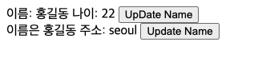
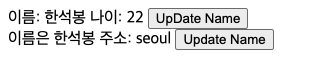
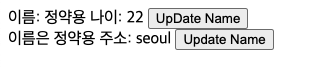

# useContext

## 📌  useContext란?
Context API의 Consumer를 사용하지 않아도 되며 더욱 쉽게 사용하기 위해 추가한 Hook

## 📌  useContext 사용방법

### 🧩 Context 객체 생성

```javascript
import React, { createContext } from 'react';
// Context 객체를 생성
const userStore = createContext(null);

const App = () => {
    return <div>
        App
    </div>
}

export default App;
```

### 🧩 Context Provider 제공
- Context 객체를 사용할 컴포넌트의 최상단 부모에게 Provider를 부모로 지정한다.
- Context 객체를 사용하고 있는 컴포넌트에게 Context의 변화를 알려준다.


```javascript
import React, { createContext, useState } from 'react';

const userStore = createContext(null);

const App = () => {
    const [name, setName] = useState("홍길동");
    return <div>
        {/* Context 객체의 프로퍼티 Provider를 호출하여 사용한다. */}
        <userStore.Provider>
            <UserAge />
            <UserAddress />
        </userStore.Provider>
    </div>
}
```

### 🧩 Context의 값을 생성

```javascript
import React, { createContext, useState } from 'react';

const userStore = createContext(null);

const App = () => {
    const [name, setName] = useState("홍길동");
    return <div>
        {/* Provider의 프로퍼티인 value에 값을 넣어준다. */}
        <userStore.Provider value={{ name, setName }}>
            <UserAge />
            <UserAddress />
        </userStore.Provider>
    </div>
}
```

### 🧩 useContext 사용

```javascript
// UserAge Component
const UserAge = () => {
    // useContext의 인자로 createContext로 생성한 Context객체를 넣어준다.
    const userInfo = useContext(userStore);
    // 결과 : {name: '홍길동', setName: ƒ}
    console.log(userInfo);
    const [age] = useState(22);
    const handleOnClick = () => userInfo.setName("한석봉")
    return <div>
        <span>{`이름: ${userInfo.name} 나이: ${age} `}</span>
        <button onClick={handleOnClick}>UpDate Name</button>
    </div>
}
```

```javascript
// UserAddress Component
const UserAddress = () => {
    const userInfo = useContext(userStore);
    const [address] = useState("seoul");
    const handleOnClick = () => userInfo.setName("정약용")
    return <div>
        <span>{`이름은 ${userInfo.name} 주소: ${address} `}</span>
        <button onClick={handleOnClick}>Update Name</button>
    </div>
}
```

## 📌 useContext의 결과

### 🧩 첫 랜더링
<p align="center">
   
</p>

### 🧩 UserAge의 button을 눌렀을 때
<p align="center">
   
</p>

### 🧩 UserAddress button을 눌렀을 때
<p align="center">
   
</p>

**🔥 state를 전역변수로 사용할 수 있다.**

## 📌 createContext의 defalutValue
- createContext의 인자는 defalutValue를 설정해준다.
- Provider를 찾지 못할시 Context에 defalutValue를 설정해준다.

```javascript
// 기본값 설정
const userStore = createContext("unKnown");

const App = () => {
    return <div>
            {/* Provider를 제공하지 않음 */}
            <UserAge />
            <UserAddress />
    </div>
}

const UserAge = () => {
    const defaultValue = useContext(userStore);
    // 결과 : unKnown
    console.log(defaultValue);
    return <div>{defaultValue}</div>
}
```

## 💻 전체 코드

```javascript
import React, { createContext, useContext, useState } from 'react';
// 스토어 생성
const userStore = createContext(null);
// App Component
const App = () => {
    const [name, setName] = useState("홍길동");
    return <div>
        <userStore.Provider value={{ name, setName }}>
            <UserAge />
            <UserAddress />
        </userStore.Provider>
    </div>
}
// UserAge Component
const UserAge = () => {
    const userInfo = useContext(userStore);
    console.log(userInfo);
    const [age] = useState(22);
    const handleOnClick = () => userInfo.setName("한석봉")
    return <div>
        <span>{`이름: ${userInfo.name} 나이: ${age} `}</span>
        <button onClick={handleOnClick}>UpDate Name</button>
    </div>
}
// UserAddress Componet
const UserAddress = () => {
    const userInfo = useContext(userStore);
    const [address] = useState("seoul");
    const handleOnClick = () => userInfo.setName("정약용")
    return <div>
        <span>{`이름은 ${userInfo.name} 주소: ${address} `}</span>
        <button onClick={handleOnClick}>Update Name</button>
    </div>
}

export default App;
```