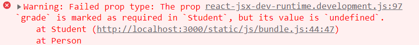

# 컴포넌트

## 📌 컴포넌트란?
코드 재사용의 기본 단위이며 독립적인 기능을 수행하는 모듈이다.

## 📌 리액트의 컴포넌트 선언방법
- 클래스 컴포넌트의 render 함수나 함수 컴포넌트의 return 문에서는 꼭 하나의 부모요소로 감싸야한다.
- Virtual DOM을 사용하기 때문이다.

### 🧩 클래스 컴포넌트
- React 16.8 버전에서 React Hooks이 도입되기전에 사용하던 문법이다.
- constructor는 필수는 아니지만 React에서 사용을 권장하고 있다.
- 부모에서 받는 속성인 props을 사용할려면 super를 호출해야하기 때문에 그때는 constructor는 필수로 사용해야한다.
- 클래스안에는 render 함수가 필수이며 render안에서는 JSX문법을 사용한다.

```javascript
import React, { Component } from 'react';

class App extends Component {
  constructor(props) {
    super(props);
    this.state: {}
  }
  
  render() {
    return <div>
      클래스 컴포넌트 선언 방법
    </div>
  }
}

export default App;
```

### 🧩 함수 컴포넌트
- React 16.8 버전부터 도입되었다.
- 함수 컴포넌트에서는 리액트 라이프 사이클을 사용하지 못하여 그것을 극복하기 위해서 React Hooks가 도입되었다.
- ES6 화살표 함수로도 선언이 가능하다.
- retrun 안에 JSX 문법을 사용한다.

```javascript
import React from 'react';

function App(props) {
  return <div>
    함수 컴포넌트 선언 방법
  </div>
}

export default App;
```

```javascript
import React from 'react';

const App = (props) => {
  return <div>
    ES6 함수 컴포넌트 선언 방법
  </div>
}

export default App;
```

### 🧩 React.Fragment
- 컴포넌트의 최상단의 부모요소로 많이 사용한다.
- 의미없는 `<div>` 태그 사용을 막고 시멘틱의 의미로 많이 사용한다.
- `<></>` 빈 모양으로도 선언이 가능하다.

```javascript
import React from 'react';

const App = () => {
  // 의미 없는 <div> 태그 사용을 막기 위한 방법
  return <React.Fragment>
    함수 컴포넌트 선언 방법
  </React.Fragment>
}

export default App;
```

```javascript
import React from 'react';

const App = () => {
  // React.Fragment를 넣어주지 않고 빈 태그로 넣어줘도 된다.
  return <>
    함수 컴포넌트 선언 방법
  </>
}

export default App;
```

## 📌 state와 props
- props는 properties의 줄임말이며 state는 일반 JavaScript의 객체이며 두 객체 모두 랜더링 결과에 영향을 준다.
- state나 props가 변경되면 재랜더링이 일어난다.
- state는 함수안에서 선언된 변수처럼 사용된다.
- props는 함수의 파라미터처럼 사용된다.

### 🧩 state 사용방법
- state를 변경하는 방법이 React에서 제공된다.
- 클래스 컴포넌트에서는 setState을 사용한다. (React 공식문서 참조)
- 함수 컴포넌트에서는 useState를 사용한다. (React 공식문서 참조)

```javascript
import React, { useState } from 'react';

const App = () => {
  /*
  useState 구조분해할당으로 나눠서 사용한다. 
  나눠진 첫 번째 요소는 getter이다 (READ)
  두 번째 요소는 setter이다. (UPDATE)
  */
  const [num, setNum] = useState(0);
  
  const increaseNum = () => {
    setNum((num) => num + 1);
  }

  return <div>
    <span>{num}</span>
    <button onClick={increaseNum}>+1</button>
  </div>
}
export default App;
```

```javascript
import React, { Component } from 'react';

class App extends Component {
  constructor() {
    super()
    this.state = {
      num: 0
    }
  }

  increaseNum = () => {
    // setState 함수를 사용하여 state를 변경한다.
    this.setState({
      num: this.state.num + 1
    });
  }
  
  render() {
    return <div>
      <span>{this.state.num}</span>
      <button onClick={this.increaseNum}>+1</button>
    </div>
  }
}

export default App;
```

### 🧩 props 사용방법

- 함수의 파라미터처럼 컴포넌트의 속성으로 넣어준다.
- 즉 상위 컴포넌트의 state도 사용이 가능하며 컴포넌트끼리 데이터를 주고 받을 수 있다.
- state를 넘겨주고 state를 변경을 자식 컴포넌트가 진행하려면 setState 함수도 같이 넘겨줘야된다.
- props는 읽기 전용이다. (리액트 규칙)
- [React 공식문서](https://ko.reactjs.org/docs/components-and-props.html#props-are-read-only)

```javascript
import React, { useState } from 'react';

const App = () => {
  const [num, setNum] = useState(0);
  const increaseNum = () => {
    setNum((num) => num + 1);
  }
  return <ShowNumber num={num} increaseNum={increaseNum}/>
}

const ShowNumber = (props) => {
  /*
  결과 : 
  {num: 0, increaseNum: ƒ}
  */
  console.log(props);
  return <div>
    <span>{props.num}</span>
    <button onClick={props.increaseNum}>+1</button>
  </div>
}

export default App;
```

## 📌 props 기본값 설정방법

- props의 기본값을 설정하는 방법은 해당 컴포넌트의 defaultProps 프로퍼티를 호출한뒤 객체를 할당하여 기본값을 설정할 수 있다.
- props로 넘겨주지 않으면 기본값이 할당된다.

```javascript
import React from 'react';

const Person = () => {
  /*
  결과 :
  이름은 홍길동 입니다.
  나이는 20살 입니다.
  */  
  return <Student />
}

const Student = (props) => {
  return <React.Fragment>
    <div>이름은 {props.name} 입니다.</div>
    <div>나이는 {props.age}살 입니다.</div>
  </React.Fragment>
}

Student.defaultProps = {
  name: "홍길동",
  age: 20
}

export default Person;
```

## 📌 propTypes 모듈을 사용한 props 검증방법
- prop의 타입이 맞지 않으면 콘솔창에 경고를 나타내주는 역할을 한다.
- prop의 타입이 맞지 않는다고해서 페이지 랜더링이 안되는 것은 아니다.
- props의 타입을 검증하는 방법은 컴포넌트의 propTypes 프로퍼티를 호출한 뒤 객체를 할당하며 prop-types 모듈을 사용하여 타입을 지정한다.
- `prop-types` 모듈은 리액트를 설치하면 자동으로 설치되는 내장 모듈이다.

```javascript
import React from 'react';
import PropTypes from 'prop-types';

const Person = () => {
  // age에 number가 아닌 string 값을 전해준다.
  return <Student name="허준" age="10" />
}

const Student = (props) => {
  /*
  결과 : 
  이름은 허준 입니다.
  나이는 10살 입니다.
  */
  return <React.Fragment>
    <div>이름은 {props.name} 입니다.</div>
    <div>나이는 {props.age}살 입니다.</div>
  </React.Fragment>
}

Student.defaultProps = {
  name: "홍길동",
  age: 20
}

Student.propTypes = {
  name: PropTypes.string,
  age: PropTypes.number
}

export default Person;
```

**🔥 콘솔 경고 화면**

<p align="center">
  
</p>

### 🧩 필수 prop를 설정하는 방법

- 필수 prop가 없으면 콘솔창에 경고를 나타내주는 역할을 한다.
- 필수 prop가 없다고 하더라도 페이지 랜더링이 안되는 것은 아니다.
- `prop-types` 모듈의 isRequired 프로퍼티를 사용한다.

```javascript
import React from 'react';
import PropTypes from 'prop-types';

const Person = () => {
  return <Student name="허준" age={10} />
}

const Student = (props) => {
  /*
  이름은 허준 입니다.
  나이는 10살 입니다.
  학년은 학년 입니다.
  */  
  return <React.Fragment>
    <div>이름은 {props.name} 입니다.</div>
    <div>나이는 {props.age}살 입니다.</div>
    <div>학년은 {props.grade}학년 입니다.</div>
  </React.Fragment>
}

Student.defaultProps = {
  name: "홍길동",
  age: 20
}

Student.propTypes = {
  name: PropTypes.string,
  age: PropTypes.number,
  // 해당 타입 뒤에 isRequired 프로퍼티를 호출한다.
  grade: PropTypes.number.isRequired
}

export default Person;
```

**🔥 콘솔 경고 화면**

<p align="center">
  
</p>

### 🧩 props 타입의 종류

- array : 배열
- arrayOf(PropType) : PropType으로 이루어진 배열
- bool : true / fasle
- func : 함수
- number : 숫자
- object : 객체
- string : 문자열

나머지 타입은 공식문서 참조   
[React 공식문서](https://ko.reactjs.org/docs/typechecking-with-proptypes.html)
