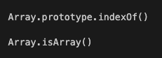

> ### Chapter2. 문자열
> - length 속성을 활용해 문자열의 길이를 확인할 수 있다.
> - 두 개 이상의 문자열을 하나의 문자열로 만들 수 있다.
> - slice() 메서드를 활용해 문자열을 원하는 만큼 ‘복사’할 수 있다.
> - 영문으로 된 문자열을 대문자 또는 소문자로 바꿀 수 있다.
> - 문자열 중 원하는 문자의 index를 찾고 접근할 수 있다 str.indexOf('a') 또는 str.lastIndexOf('a'),str[1]
> - includes() 메서드를 활용해 문자열 중 원하는 문자가 포함되어 있는지 알 수 있다. str.includes('a')
> - split() , join() 메서드를 활용해 문자열을 배열로 바꾸거나, 배열을 문자열로 바꿀 수 있다.
> - 템플릿 리터럴(Template literals) 문법을 사용할 수 있다.

## 📌 문자열
자바스크립트에서는 기본 자료형으로 문자들이 연결된 문자들의 집합이다.

### 🧩 연결 연산자 (+)
- 문자열과 문자열 사이에서 + 연산자를 사용하면 문자열을 연결한다.

```javascript
const head = "hello";
const tail = "world !!";
const result = head + " " + tail;
// 결과 : hello world !!
console.log(result);
```

`+` 연산자를 사용하면 문자열을 연결한다. 공백도 문자열이다.

## 📌 문자열 메소드

### 🧩 문자열 추출
2개의 메소드 모두 시작점부터 끝점 -1 까지의 문자열을 정제한다. 원본 문자열은 바뀌지 않는다. 차이점은 음수 등등이 들어가면 작동 방식이 달라지지만 두개다 비슷한 기능을 수행한다.

- slice("시작점", "끝점")
- substring("시작점", "끝점")

### 🧩 문자열 검색
검색할 값과 시작 인덱스를 넣어주면 해당 문자열에서 검색을 시작한다 시작 인덱스를 넣어주지 않으면 0번 인덱스부터 수행한다. 또한 다른점은 indexOf는 인덱스 번호를 반환하며 요소가 없을 경우 -1를 반환하고 includes는 Boolean 값을 반환한다

- indexOf("검색할 값", "시작 인덱스")
- includes("검색할 값", "시작 인덱스")

### 🧩 문자열 정제
해당 문자열을 분리할 대상 문자 기준으로 나눠주며 정지 카운터의 개수를 지정하면 앞에서 부터 해당 숫자만큼만 잘라주고 나머지는 그대로 반환한다.

- split('분리할 대상 문자', '정지 카운트')

### 🧩 문자열 교체
해당 문자열의 요소를 교체한다. replace는 교체 대상 문자의 요소의 하나만 교체하며 replaceAll은 전부 교체한다. replce에 정규식을 사용하면 replaceAll처럼 사용이 가능하다.

- replace("교체 대상", "교체할 내용")
- replaceAll("교체 대상", "교체할 내용")

## 📌 Math 메소드

- Math.ceil() : 올림
- Math.floor() : 내림
- Math.round() : 반올림
- Math.sqrt() : 제곱
- Math.abs() : 절대값
- Math.min() : 최소값
- Math.max() : 최대값

# 🎯 심화내용

> ## Chapter2. 문자열
> - 메소드와 프로퍼티란?
> - 인스턴스와 객체의 차이점
> - 프로토타입 메소드와 정적 메소드란?

## 📌 프로퍼티와 메소드란?
① 프로퍼티 : 의미로는 속성으로 객체의 특징이다. (프로퍼티는 속성이란 같은 말이다.)   
② 메소드 : 의미로는 행동으로 JavaScript에서는 함수로 된 프로퍼티이다.

```JavaScript
const Object = {
    // 프로퍼티는 객체의 각각의 요소라고 생각해도 된다.
    property: "property",
    // 메소드는 프로퍼티이며 함수로된 프로퍼티를 메소드라고 한다.
    method: function() {
        console.log("method");
    }
}
```

## 📌 인스턴스와 객체의 차이점

객체 : 키와 값으로 구성되어있는 자료구조이다.
인스턴스 : 자바스크립트에서는 생성자함수 함수에 new 연산자를 사용하여 생성한 객체이다.   

```javascript
// 객체
const object = {
    a: 1,
    b: 2
}
// 생성자 함수
function Instance(value) {
    this.value = value;
    this.log = function() {
        console.log(this.value);
    }
}
// 생성자 함수에 값을 다르게 줘서 2개의 인스턴스를 생성하였다.
const instance1 = new Instance(1);
const instance2 = new Instance(2);
// 1 출력
instance1.log();
// 2 출력
instance2.log();
```

인스턴스는 생성자 함수가 만들어낸 객체이다. 객체의 프로퍼티를 동적으로 변경 시켜주고 싶을 때 생성자함수를 만들고 인스턴스를 생성한다. 즉 구조를 생성하고 그 구조에 값만 바꿔줘서 사용하는 것이 인스턴스이다.

## 📌 정적 메소드와 프로토타입 메소드

- 정적 메소드: 인스턴스를 생성하지 않고 직접 함수를 호출할 수 있다.
- 프로토타입 메소드: 인스턴스를 생성해서 호출할 수 있다.

```javascript
// copyArr 생성
function CopyArray(arr) {
    this.arr = [];
    
    for(let i = 0; i < arguments.length; i++) {
        this.arr[i] = arguments[i];
    }

    // 인스턴스 메소드로 생성하였지만 프로토타입 메소드랑 비슷하다고 생각하면 됩니다. 나중에 가서 다른점을 알게됩니다.
    this.push = function(value) {
        const lastIndex = this.arr.length - 1;
        this.arr[lastIndex + 1] = value;
        return this.arr.length;
    }

    return this.arr;
}
// 정적 메소드
CopyArray.isArray = function(value) {
    return Array.isArray(value);
}
// 실제 배열의 push 메소드처럼 작동됩니다.
const copyArr = new CopyArray(1,2,3,4);
// 결과 : [1, 2, 3, 4]
console.log(copyArr);
// push 5
copyArr.push(5);
// 결과 : [1, 2 ,3, 4, 5]
console.log(copyArr);
/* 배열의 실제 선언 방법 */
const arr = new Array(1,2,3,4);
```

- 배열을 일반적으로 const arr = [1,2,3,4]으로 사용하면 자바스크립트 엔진은 const arr = new Array(1,2,3,4)의 과정으로 만드는 것으로 알고 있습니다.
- 사실 배열 const arr = [1,2,3,4]라고 선언한 것이 풀어서 말하면 Array 생성자 함수의 요소가 1,2,3,4인 인스턴스를 만든 과정입니다. 그래서 내부 생성자 함수에 이미 만들어진 메소드들인 push, pop, 등등의 메소드를 사용할 수 있게 됩니다.
- 정적 메소드는 Array 자체에 걸려 있는 메소드이기 때문에 인스턴스를 생성할 필요가 없어서 Array. --- 의 형태로 바로 호출을 하는 것 입니다.

<p align="center">
  
</p>

[mdn](https://developer.mozilla.org/ko/docs/Web/JavaScript/Reference/Global_Objects/Array)에서 배열의 내장 객체를 확인 할 때 방법

- 생성자함수.prototype.메소드 형태인 것은 인스턴스를 생성해서 만들 결과물에 직접 함수를 사용해야 합니다.

- 생성자함수.메소드 형태인 것은 직접 그 생성자함수에 .을 붙혀서 사용합니다.

```javascript
// 인스턴스 생성
const arr = [1,2,3,4]

/*
이 과정을 자동적으로 해준다고 생각하시면 됩니다.
const arr = new Array(1,2,3,4);
*/

// 인스턴스가 담겨있는 변수에서 함수를 호출
arr.indexOf(1);
// 결과 : true
Array.isArray(arr);
```