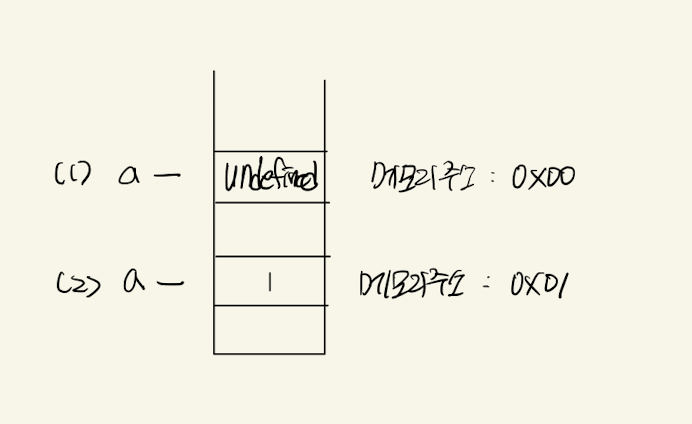

# ✉️ 학습목표

> ## Chapter1. 변수
> - 변수 사용은 데이터를 편리하게 저장하고 꺼내 쓰는 것임을 이해한다.
> - JavaScript에서 변수의 선언과 값의 할당에 대해서 설명할 수 있다.
> - =가 "같다"라는 의미가 아니라 할당 연산자임을 이해할 수 있다.
> - 크롬 개발자 도구의 console 탭을 이용하여 원하는 값을 출력할 수 있다.
> - 변수를 사용하여 보다 효과적으로 구구단을 출력할 수 있다.

## 📌  변수의 정의와 사용목적

- 변수란 메모리에 저장되어 있는 값을 사용할 수 있게 해주는 식별자 역할을 한다.
- 변수의 사용목적은 저장되어 있는 값을 읽어서 사용하기 위해 사용한다.

## 📌 변수 생명주기
변수의 생명주기는 `[선언 -> 초기화 -> 할당 -> 재할당 -> 소멸]` 단계로 진행된다.

### 🧩 변수의 선언
- 변수의 선언은 `let` 문법을 사용하여 선언한다. 선언과 동시에 초기화가 진행된다.
- 초기화란 변수에 `undefined`로 초기화하는 행위이다.

```javascript
// varible 이라는 이름을 가진 변수를 선언한다.
let varible;
// 결과 : undefined
console.log(varible);
```

### 🧩 변수의 할당
- 변수의 할당은 할당연산자 `=`를 사용하여 할당한다.
- 변수는 선언과 할당을 동시에 할 수 있다.

```javascript
// 변수 선언
let varible;
// 변수 할당
varible = "변수";
// 변수의 선언과 할당을 동시에 한다.
let v = "선언과 동시에 할당";
```

### 🧩 변수의 재할당
- 변수의 재할당이란 변수의 값을 바꾸는 행위를 뜻한다.

```javascript
// 변수의 선언과 할당
let varible = "초기값";
// 변수의 값 재할당
varible = "재할당";
```

### 🧩 변수의 소멸
변수의 소멸이란 메모리에 저장되어 있는 값이 정리되는 행위이다.

- 지역 변수의 소멸 : 지역 변수가 저장되어 있는 함수나 실행문 반복문 조건문 등이 완료되면 소멸한다.
- 전역 변수의 소멸 : 웹 페이지를 닫는 순간 소멸한다.

## 📌 할당 연산자 (`=`)

할당연산자는 같다라는 뜻이 아니라 대입한다라는 뜻이다. 같다라고 물어볼 경우 비교연산자 (`==`),(`===`)를 사용한다.

## 💻 변수를 활용한 구구단

```javascript
// 변수만 바꿔주면 원하는 구구단을 출력이 가능하다.
let num = 2;
// 콘솔창으로 구구단 출력
console.log(num, '*', 1, '=', num * 1);
console.log(num, '*', 2, '=', num * 2);
console.log(num, '*', 3, '=', num * 3);
console.log(num, '*', 4, '=', num * 4);
console.log(num, '*', 5, '=', num * 5);
console.log(num, '*', 6, '=', num * 6);
console.log(num, '*', 7, '=', num * 7);
console.log(num, '*', 8, '=', num * 8);
console.log(num, '*', 9, '=', num * 9);
```

-------------------

# 🎯 심화내용

> ## Chapter1. 변수
> - 상수와 변수
> - 변수의 선언과 동시에 초기화가 진행되어 undefined으로 초기화되는 이유
> - 변수의 var, let의 차이

## 📌 상수와 변수

- 식별자의 종류에는 상수와 변수가 존재한다.
- 상수의 값은 불변이며 변수의 값은 교체가 가능하다.

### 🧩 상수

- 선언과 동시에 값을 할당해서 사용해야한다.
- `const` 문법을 사용하여 선언한다.

```javascript
// 선언과 동시에 값을 할당한다.
const constant = 10;
// 결과 : 오류 출력 (상수는 재할당이 불가능하다.)
constant = 20;
```

## 📌 변수가 undefined으로 초기화되는 이유

변수에 메모리 주소를 할당할 때 메모리의 값이 있을 수도 있으므로 혹시 모를 상황을 방지하기 위해 `undefined`로 초기화를 진행한다.

### 🧩 메모리에 쓰레기값이 들어있다고 가정

변수를 선언하였을 때 우연히 메모리에 쓰레기값이 남아있는 주소를 할당받았다는 과정

<p align="center">
  
</p>

```javascript
let a;
// 위의 상황을 가정하면 결과가 1이 나온다.
console.log(a);
```

### 🧩 메모리를 초기화 하는 과정

<p align="center">
  
</p>

```javascript
// (1)번 진행
let a;
// 결과 : undefined
console.log(a);
// (2)번 진행
a = 1;
// 결과 : 2
console.log(2);
```

- 혹시 모를 쓰레기 값을 방지하기 위해 메모리에 undefined를 할당한 주소값으로 처음에 초기화 시킨 뒤에 값 1을 할당한다.

- `let a = 1`처럼 선언과 할당을 동시에 하더라도 초기화가 진행된 뒤 할당한다.

## 📌 var, let의 차이점

- var와 let의 공통점은 둘다 변수이다.
- let을 사용하는 이유는 var 변수의 호이스팅 문제 때문에 사용한다.
- 스코프의 개념에서 안 쓰는 이유를 더욱 더 자세하게 배운다.

### 🧩 호이스팅이란?
사전적 의미로는 끌어올린다는 뜻으로 변수가 아래에 선언이 되어도 있어도 최상단으로 끌어 올려진 것처럼 작동하는 것을 호이스팅이라고 한다.

- 변수의 값의 초기화 단계에서 변수에 `undefined`이 먼저 할당 된다.
- 값의 초기화 단계까지는 코드가 순차적으로 실행되기 이전에 실행된다.

```javascript
// 결과 : undefined
console.log(name);
// 변수의 선언과 할당
var name = "YHJ";
```

호이스팅은 변수선언과 할당이 실행문 아래에 있지만 초기화값인 undefined을 출력한다.

### 🧩 let과 var의 차이점
let과 var는 둘다 같은 변수로 사용방법은 같지만 각각의 특성이 다르다.

- let은 호이스팅이 발생은 하지만 자바스크립트 엔진에서 오류를 출력해준다.
- var는 호이스팅이 발생하면 초기화 변수인 undefined 출력된다.

```javascript
// 결과 : 오류 출력
console.log(name);
// 변수의 선언과 할당
let name = "YHJ";
```

### 🧩 let을 사용하는 이유

let을 사용하는 이유는 코드가 만약 길어진다면 var를 사용하여 의도치 않게 선언전에 할당을 하고 아래에 선언하였으면 undefined의 값을 사용하게 됨으로 개발자의 의도와 다른 값이 설정될 수 있으므로 그것을 방지하기 위해서 let을 사용한다.